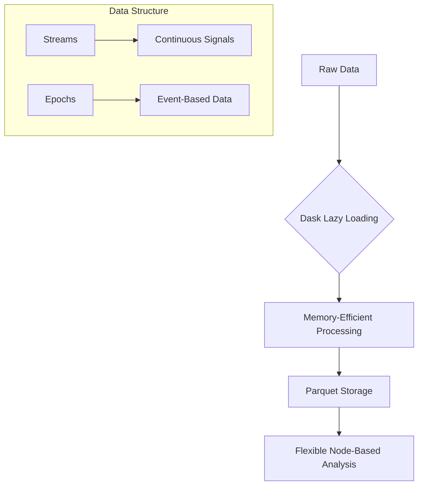
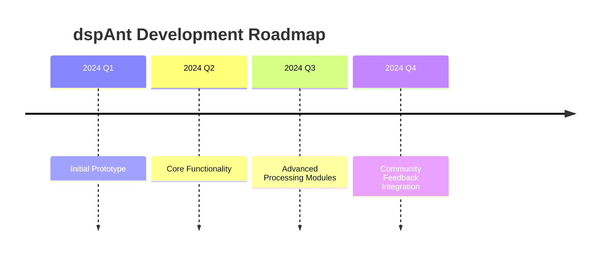

# dspAnt 🐜

A flexible and powerful framework for processing time-series data, with a focus on neural and physiological signals.

## 🌟 Project Vision

dspAnt aims to simplify complex signal processing workflows by providing an intuitive, performant, and scalable approach to data analysis.

## 🚀 Key Design Principles

### Data Processing Philosophy



### Why Our Approach?

1. **Lazy Loading**: Process large datasets without memory constraints
2. **Standardized Metadata**: Consistent data description across different sources
3. **Flexible Processing**: Attach processing functions to raw data dynamically
4. **Scalable Architecture**: Designed for complex scientific workflows

### Metadata Example

We use a structured metadata approach to provide clear, comprehensive information about your data:

```json
{
    "base": {
        "name": "RawEMG",
        "sampling_rate": 24414.0625,
        "total_samples": 35143680,
        "channels": {
            "count": 2,
            "names": ["Channel1", "Channel2"],
            "units": ["V", "V"]
        }
    },
    "recording_details": {
        "date": "2024-02-25",
        "subject_id": "9882-1",
        "experiment_type": "EMG Contusion"
    }
}
```

## 🛠 Current Features

- Dask-powered lazy data processing
- PyArrow-based memory-mapped reading
- Parquet file storage
- Flexible node-based processing
- Support for streams and epoch-based data

## 📡 Community & Support

- **Discord**: [Join our Community](https://discord.gg/jGPJTrSU)
- **Inspiration**: [SpikeInterface](https://github.com/SpikeInterface/spikeinterface.git)

## 🧠 Development Approach

This project is developed with the assistance of AI language models (Claude, ChatGPT, Meta AI). 

**Disclaimer**: As an evolving prototype, expect ongoing improvements and potential bugs.

## 🗺️ Project Roadmap



## 🤝 Contributions

Interested in contributing? We welcome:
- Bug reports
- Feature suggestions
- Code contributions
- Documentation improvements

## 📊 Technology Stack

- **Language**: Python
- **Lazy Processing**: Dask
- **Data Storage**: PyArrow, Parquet
- **Signal Processing**: NumPy, SciPy
- **Performance**: Numba

## 📦 Installation (Coming Soon)

```bash
pip install dspant
```

## 📚 Quick Example

```python
from dspant import StreamNode, create_processing_node

# Load your data
stream = StreamNode('path/to/your/data.parquet')

# Create a processing pipeline
processor = create_processing_node(stream)
processor.add_processor(filter_processor)
processor.add_processor(envelope_processor)

# Process data lazily
processed_data = processor.process()
```

## License

[To be determined]

## References

[1] SpikeInterface: https://github.com/SpikeInterface/spikeinterface.git