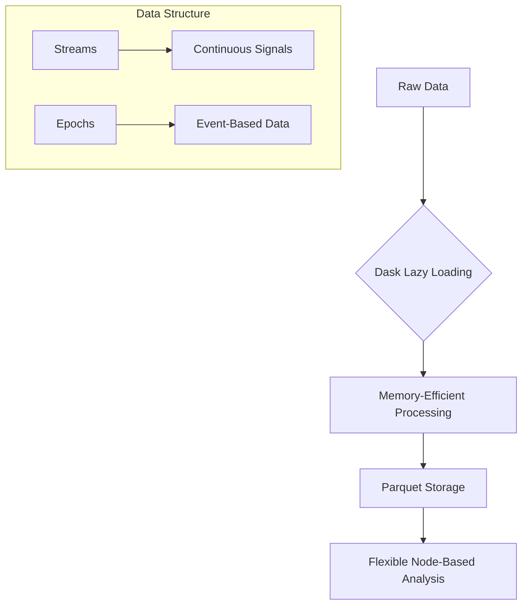
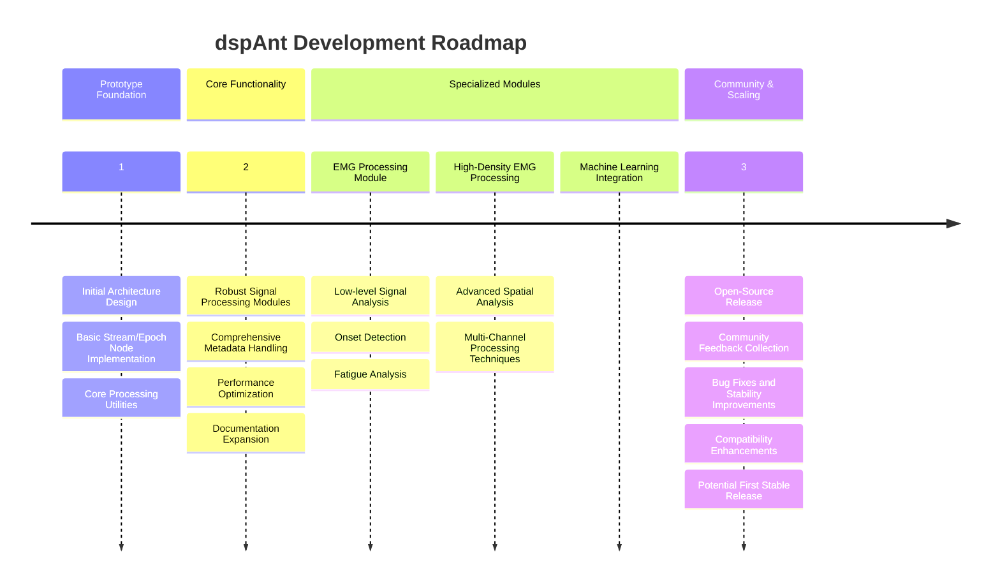

# dspAnt 🐜

A flexible and powerful framework for processing time-series data, with a focus on neural and physiological signals.

## 🌟 Project Vision

dspAnt aims to simplify complex signal processing workflows by providing an intuitive, performant, and scalable approach to data analysis.

## 🚀 Key Design Principles

### Data Processing Philosophy



### Why Our Approach?

1. **Lazy Loading**: Process large datasets without memory constraints
2. **Standardized Metadata**: Consistent data description across different sources
3. **Flexible Processing**: Attach processing functions to raw data dynamically
4. **Scalable Architecture**: Designed for complex scientific workflows

### Metadata Example

We use a structured metadata approach to provide clear, comprehensive information about your data:

```json
{
    "base": {
        "name": "RawEMG",
        "sampling_rate": 24414.0625,
        "total_samples": 35143680,
        "channels": {
            "count": 2,
            "names": ["Channel1", "Channel2"],
            "units": ["V", "V"]
        }
    },
    "recording_details": {
        "date": "2024-02-25",
        "subject_id": "9882-1",
        "experiment_type": "EMG Contusion"
    }
}
```

## 🛠 Current Features

- Dask-powered lazy data processing
- PyArrow-based memory-mapped reading
- Parquet file storage
- Flexible node-based processing
- Support for streams and epoch-based data

## 📡 Community & Support

- **Discord**: [Join our Community](https://discord.gg/jGPJTrSU)
- **Inspiration**: [SpikeInterface](https://github.com/SpikeInterface/spikeinterface.git)

## 🧠 Development Approach

This project is developed with the assistance of AI language models (Claude, ChatGPT, Meta AI). 

**Disclaimer**: As an evolving prototype, expect ongoing improvements and potential bugs.

## 🗺️ Project Roadmap



## 🤝 Contributions

Interested in contributing? We welcome:
- Bug reports
- Feature suggestions
- Code contributions
- Documentation improvements

## 📊 Technology Stack

- **Language**: Python
- **Lazy Processing**: Dask
- **Data Storage**: PyArrow, Parquet
- **Signal Processing**: NumPy, SciPy
- **Performance**: Numba

## 📦 Installation (Coming Soon)

### Current 
``` bash
git clone repo
# cd to directory
# --extra for stft functionality

uv sync --extra cu124
```
### Coming Soon
```bash
pip install dspant
```

## 📚 Quick Example


```python
"""
Functions to extract onset detection - Complete test script
Author: Jesus Penaloza (Updated with envelope detection and onset detection)
"""

# %%
import matplotlib.pyplot as plt
import numpy as np
import polars as pl
import seaborn as sns

from dspant.emgproc.activity import (
    EMGOnsetDetector,
    create_absolute_threshold_detector,
)
from dspant.engine import create_processing_node
from dspant.nodes import StreamNode
from dspant.processor.basic import (
    create_tkeo_envelope,
)
from dspant.processor.filters import (
    ButterFilter,
    FilterProcessor,
)

sns.set_theme(style="darkgrid")
# %%

base_path = r"data"


emg_stream_path = base_path + r"/RawG.ant"
# %%
# Load EMG data
stream_emg = StreamNode(emg_stream_path)
stream_emg.load_metadata()
stream_emg.load_data()
# Print stream_emg summary
stream_emg.summarize()

# %%
# Create and visualize filters before applying them
fs = stream_emg.fs  # Get sampling rate from the stream node

# Create filters with improved visualization
bandpass_filter = ButterFilter("bandpass", (20, 2000), order=4, fs=fs)
# %%
fig_bp = bandpass_filter.plot_frequency_response(
    show_phase=True, cutoff_lines=True, freq_scale="log", y_min=-80
)
# plt.show()  # This displays and clears the current figure
# plt.savefig("bandpass_filter.png", dpi=300, bbox_inches='tight')
# %%
notch_filter = ButterFilter("bandstop", (58, 62), order=4, fs=fs)
fig_notch = notch_filter.plot_frequency_response(
    title="60 Hz Notch Filter", cutoff_lines=True, freq_scale="log", y_min=-80
)
plt.show()  # This displays and clears the current figure
# plt.savefig("notch_filter.png", dpi=300, bbox_inches='tight')
# %%
# Create processing node with filters
processor_hd = create_processing_node(stream_emg)
# %%
# Create processors
notch_processor = FilterProcessor(
    filter_func=notch_filter.get_filter_function(), overlap_samples=40
)
# %%
bandpass_processor = FilterProcessor(
    filter_func=bandpass_filter.get_filter_function(), overlap_samples=40
)
# %%
# Add processors to the processing node
processor_hd.add_processor([notch_processor, bandpass_processor], group="filters")
# %%
# View summary of the processing node
processor_hd.summarize()

# %%
# Apply filters and plot results
filter_data = processor_hd.process(group=["filters"]).persist()
# %%
# ======= ENVELOPE DETECTION TESTING =======
# Create and apply multiple envelope detection methods

# First, get the filtered data as our base
base_data = filter_data


# %%
# 4. Create TKEO envelope pipeline
tkeo_pipeline = create_tkeo_envelope(
    method="modified", rectify=True, smooth=True, cutoff_freq=20, fs=fs
)

# Add to processing node
processor_tkeo = create_processing_node(stream_emg, name="TKEO")
# First add basic filtering
processor_tkeo.add_processor([notch_processor, bandpass_processor], group="preprocess")
# Then add envelope processors
for proc in tkeo_pipeline.get_group_processors("envelope"):
    processor_tkeo.add_processor(proc, group="envelope")

# Process data
tkeo_data = processor_tkeo.process(group=["preprocess", "envelope"]).persist()

# %%
# Define channel to analyze


# Create onset detectors with absolute thresholds
abs_detector = EMGOnsetDetector(
    threshold_method="absolute",  # Use absolute threshold
    threshold_value=tkeo_data.mean().compute(),  # Adjust this value based on your data scale
    min_duration=0.1,  # Minimum 100ms duration for valid activation
)
channel_data = tkeo_data[:, :].persist()
# Apply onset detection to envelope
# First to TKEO envelope (often gives good results for onset detection)
tkeo_onsets_abs = abs_detector.process(data=channel_data, fs=fs)

# Convert to Polars DataFrame for easier analysis
tkeo_abs_df = abs_detector.to_dataframe(tkeo_onsets_abs.compute())
# %%
channel_id = 1  # Change as needed for your data
# Filter for our channel of interest
tkeo_abs_df_ch = tkeo_abs_df.filter(pl.col("channel") == channel_id)
print(tkeo_abs_df_ch)
# Print activation statistics
print("\nAbsolute threshold activations stats:")
print(f"Total activations: {len(tkeo_abs_df_ch)}")
if len(tkeo_abs_df_ch) > 0:
    print(f"Mean duration: {tkeo_abs_df_ch['duration'].mean():.3f} s")
    print(f"Mean amplitude: {tkeo_abs_df_ch['amplitude'].mean():.3f}")
# %%
# Define the time window to plot
plot_start = 0
plot_end = 50000
plot_time = np.arange(plot_start, plot_end) / fs

# Plot filtered data, envelope, and detected onsets
plt.figure(figsize=(12, 8))

# Plot original signal and envelope
plt.subplot(2, 1, 1)
plt.plot(
    plot_time,
    base_data[plot_start:plot_end, channel_id],
    "k",
    alpha=0.5,
    label="Filtered",
)
plt.plot(
    plot_time, tkeo_data[plot_start:plot_end, channel_id], "m", label="TKEO Envelope"
)
plt.title(f"EMG Signal and Envelope - Channel {channel_id}")
plt.ylabel("Amplitude")
plt.legend()
plt.grid(True)

# Plot envelope with onsets/offsets
plt.subplot(2, 1, 2)
plt.plot(
    plot_time, tkeo_data[plot_start:plot_end, channel_id], "m", label="TKEO Envelope"
)

# Plot threshold
if hasattr(abs_detector, "thresholds") and abs_detector.thresholds is not None:
    threshold = abs_detector.thresholds[channel_id]
    plt.axhline(y=threshold, color="r", linestyle="--", label="Threshold")

# Mark onsets and offsets
for row in tkeo_abs_df_ch.iter_rows(named=True):
    onset_idx = row["onset_idx"]
    offset_idx = row["offset_idx"]

    # Only plot if in our time window
    if plot_start <= onset_idx < plot_end:
        # Onset marker
        plt.axvline(x=onset_idx / fs, color="g", linestyle="-", alpha=0.7)
        plt.text(
            onset_idx / fs,
            0,
            "ON",
            color="g",
            fontsize=8,
            horizontalalignment="center",
            verticalalignment="bottom",
        )

    if plot_start <= offset_idx < plot_end:
        # Offset marker
        plt.axvline(x=offset_idx / fs, color="r", linestyle="-", alpha=0.7)
        plt.text(
            offset_idx / fs,
            0,
            "OFF",
            color="r",
            fontsize=8,
            horizontalalignment="center",
            verticalalignment="bottom",
        )

plt.title("Absolute Threshold Onset Detection")
plt.xlabel("Time (s)")
plt.ylabel("Amplitude")
plt.legend()
plt.grid(True)

plt.tight_layout()
plt.savefig("emg_onset_detection_absolute.png", dpi=300, bbox_inches="tight")
plt.show()

# Optional: Display activations in a table format
if len(tkeo_abs_df_ch) > 0:
    print("\nFirst 10 activations using absolute threshold detector:")
    display_cols = ["onset_idx", "offset_idx", "amplitude", "duration"]
    display_df = tkeo_abs_df_ch.select(display_cols).head(10)

    # Convert sample indices to time
    display_df = display_df.with_columns(
        pl.col("onset_idx") / fs, pl.col("offset_idx") / fs
    ).rename({"onset_idx": "onset_time_s", "offset_idx": "offset_time_s"})

    print(display_df)

# %%

```

## License

[To be determined]

## References

[1] SpikeInterface: https://github.com/SpikeInterface/spikeinterface.git


## License and Disclaimer

### Liability Disclaimer

**IMPORTANT: USE AT YOUR OWN RISK**

THIS SOFTWARE IS PROVIDED "AS IS", WITHOUT WARRANTY OF ANY KIND, EXPRESS OR IMPLIED. IN NO EVENT SHALL THE AUTHORS OR COPYRIGHT HOLDERS BE LIABLE FOR ANY CLAIM, DAMAGES, OR OTHER LIABILITY ARISING FROM THE USE OF THIS SOFTWARE.

Users are solely responsible for:
- Verifying the accuracy and appropriateness of results
- Ensuring proper implementation in their specific use case
- Checking and validating all outputs
- Any consequences resulting from the use of this software
