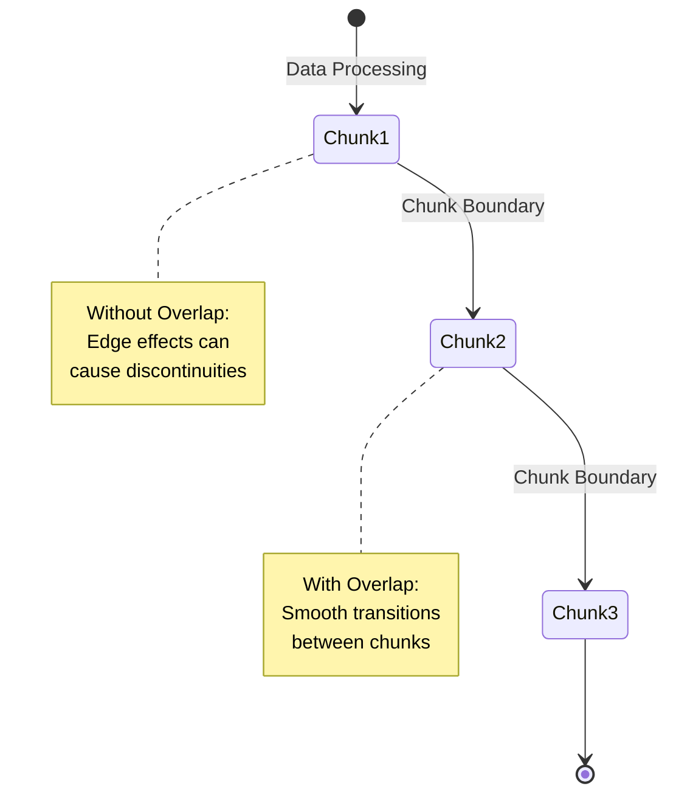

# Creating a Custom Processor in dspant

## Overview

Processors in dspant are powerful components that transform time-series data through a standardized interface. This guide will walk you through creating a custom processor, explaining its key components and design principles.

## Key Components of a Processor

A dspant processor typically consists of several crucial elements:

### 1. Initialization (`__init__`)
The constructor sets up the processor's configuration and initial state.

```python
def __init__(
    self, 
    parameter1: Type = default_value,
    parameter2: Optional[Type] = None
):
    # Validate input parameters
    self._validate_parameters()
    
    # Store configuration
    self.parameter1 = parameter1
    self.parameter2 = parameter2
    
    # Set overlap samples (important for chunk processing)
    self._overlap_samples = 0
```

### 2. Process Method (`process`)
The core method that transforms input data.

```python
def process(
    self, 
    data: da.Array, 
    fs: Optional[float] = None, 
    **kwargs
) -> da.Array:
    # Ensure input is 2D
    if data.ndim == 1:
        data = data[:, np.newaxis]
    
    def transform_chunk(chunk: np.ndarray) -> np.ndarray:
        # Chunk-wise transformation logic
        # Use Numba for performance if possible
        return transformed_chunk
    
    # Use map_blocks for parallel, chunk-wise processing
    result = data.map_blocks(
        transform_chunk,
        dtype=np.float32,
        chunks=data.shape[1]
    )
    
    return result
```

### 3. Overlap Samples (`overlap_samples`)
A critical property for handling chunk boundaries in signal processing.

```python
@property
def overlap_samples(self) -> int:
    """Return number of samples needed for overlap"""
    return self._overlap_samples
```

### 4. Summary Method (`summary`)
Provides configuration details for introspection.

```python
@property
def summary(self) -> Dict[str, Any]:
    """Get a summary of processor configuration"""
    base_summary = super().summary
    base_summary.update({
        "key1": self.parameter1,
        "key2": self.parameter2,
        # Add any additional configuration details
    })
    return base_summary
```

## Understanding Overlap

### Why Overlap Matters



Overlap ensures that algorithms requiring context (like filters, derivatives) 
work correctly across chunk boundaries.

### Example: Derivative Calculation with Overlap

```python
class DerivativeProcessor(BaseProcessor):
    def __init__(self, method: str = 'forward'):
        self.method = method
        # Overlap of 1 to ensure we can calculate derivatives at chunk edges
        self._overlap_samples = 1

    def process(self, data: da.Array, **kwargs) -> da.Array:
        def compute_derivative(chunk: np.ndarray) -> np.ndarray:
            if chunk.ndim == 1:
                chunk = chunk.reshape(-1, 1)
            
            # Compute derivative with careful handling of chunk boundaries
            derivatives = np.zeros_like(chunk)
            for c in range(chunk.shape[1]):
                channel = chunk[:, c]
                derivatives[:, c] = np.gradient(channel)
            
            return derivatives

        return data.map_blocks(
            compute_derivative,
            dtype=data.dtype,
            chunks=data.shape[1],
            drop_axis=None
        )

    @property
    def overlap_samples(self) -> int:
        return self._overlap_samples
```

## Best Practices

1. **Performance**: Use Numba for computational heavy lifting
2. **Flexibility**: Support various input configurations
3. **Parallelism**: Leverage Dask's map_blocks for efficient processing
4. **Reproducibility**: Allow random seed setting when applicable

## Factory Function Pattern

```python
def create_custom_processor(
    parameter1: Type = default,
    parameter2: Optional[Type] = None
) -> CustomProcessor:
    """
    Create a configured processor instance.
    
    Provides a convenient way to instantiate processors
    with standard configurations.
    """
    return CustomProcessor(
        parameter1=parameter1,
        parameter2=parameter2
    )
```

## Error Handling and Validation

- Validate input parameters in `__init__`
- Provide meaningful error messages
- Handle edge cases (1D vs 2D inputs, empty arrays)

## Performance Considerations

### Numba Acceleration
```python
@jit(nopython=True, parallel=True, cache=True)
def _core_computation(data: np.ndarray) -> np.ndarray:
    # Computationally intensive core logic
    # Parallelized and compiled for maximum performance
```

### Dask Chunk Processing
- Use `map_blocks` for parallel processing
- Specify correct chunk dimensions
- Minimize data movement between chunks

## Recommended Libraries

- NumPy: Numerical computations
- Numba: Performance acceleration
- Dask: Parallel array processing
- SciPy: Advanced signal processing

## Conclusion

Creating a custom processor in dspant involves understanding:
- Chunk-wise processing
- Parallel computation
- Handling edge cases
- Providing flexible configurations

Follow these principles to create robust, high-performance signal processing components.